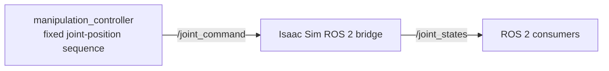
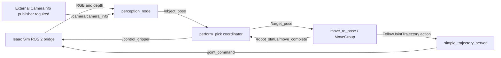

# Architecture and topic map

This repository contains one standalone Isaac Sim example and two ROS 2 demo paths. They are examples, not a validated robot-control product.

## Standalone Isaac Sim demo

`scripts/sim_demo.py` starts Isaac Sim, loads the Franka and a dynamic cube, then passes the cube and place positions to NVIDIA's `PickPlaceController`. The simulator advances the world and applies the returned articulation actions. This path does not use ROS 2.

## ROS 2 paths

`scripts/sim_setup.py` starts Isaac Sim and authors a ROS 2 bridge graph. The graph publishes joint state, camera RGB/depth, and TF data, and subscribes to `/joint_command` and the gripper service. It does not create a CameraInfo publisher.

The direct joint-command example is:

The perception and MoveIt example is:

`visual_pick.launch.py` starts the MoveIt, transform, perception, and pose-command pieces. `scripts/verify_project.sh` starts Isaac Sim and `demo_recording.launch.py`, which is the separate recorded-sequence path. Follow the README for the commands and required environments.

The perception node subscribes to `/camera/camera_info` and needs camera intrinsics before it can project detections. The current `sim_setup.py` graph does not publish that topic, so the perception-to-MoveIt example requires an external CameraInfo publisher or a future bridge-graph correction before it can run end to end from this repository alone.

## Package responsibilities

- `simple_manipulation/detection.py` holds image-mask, depth lookup, pinhole projection, and rigid-transform helpers. The deterministic unit tests use synthetic pixels and known transforms.
- `perception_node.py` connects camera topics and TF to those helpers and publishes detected poses.
- `perform_pick.py` coordinates observation, pose commands, and the gripper service. Its recovery path and wrist-rotation retry are incomplete.
- `simple_trajectory_server.py` adapts trajectory points to `/joint_command` by waiting each point's time and publishing it. It does not interpolate points or report measured tracking error.
- `simple_moveit_interface` accepts target poses, requests MoveIt plans, executes them, and publishes a completion signal.

## Validation and limitations

GitHub CI builds the ROS 2 packages and runs the synthetic perception-helper tests. It does not launch Isaac Sim, MoveIt, RViz, cameras, or a ROS graph. The Isaac versions in the source also differ: the standalone example identifies Isaac Sim 5.0, while the ROS bridge comments and smoke-script fallback identify 4.5.0. That compatibility gap remains unverified.

The perception example selects the largest red image region. Its synthetic tests do not establish camera calibration or successful physical grasps. The trajectory adapter is a demonstration implementation with no interpolation or feedback. Do not use these examples to support robot safety, reliability, production, or sim-to-real claims.
